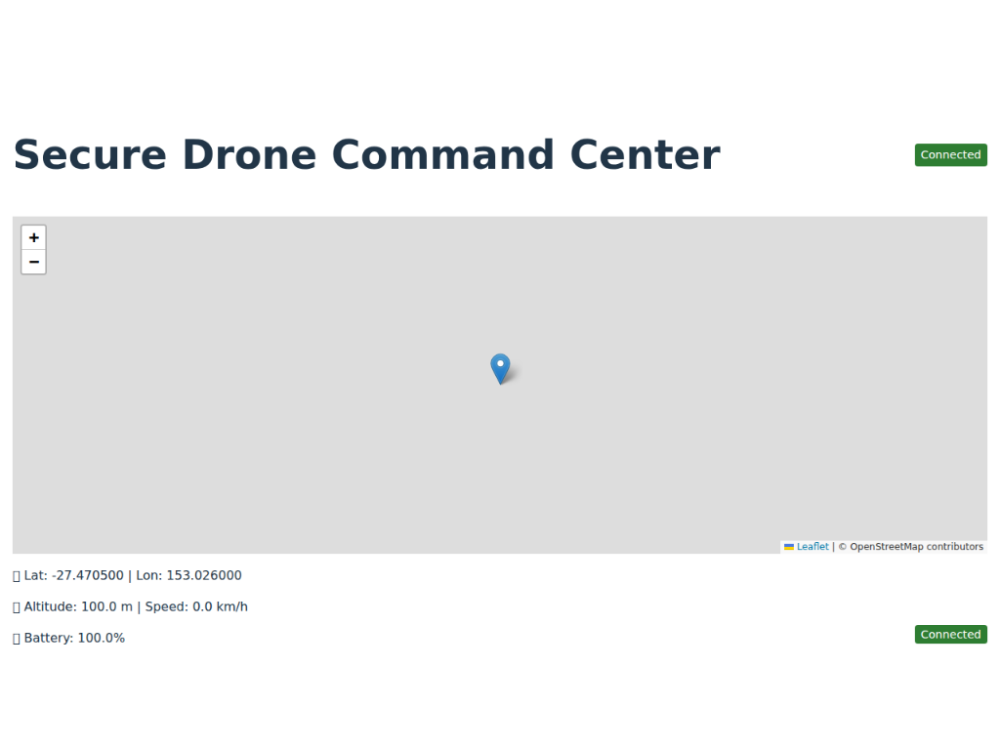

# Secure Drone Command & Control

A complete example of a UAV command center built with Flask and React. The project streams telemetry in real time, logs data to SQLite and allows issuing simple control commands. It is ideal for training simulations or demonstrating secure WebSocket communication.

## Quick Start

Run the full stack with the provided script:

```bash
./scripts/start.sh
```

This launches the backend, drone simulator and frontend together.

---

## Features

- Real-time telemetry: latitude, longitude, altitude, speed and battery level
- Drone position rendered on a **Leaflet.js** map with auto recentring
- Flight path polyline showing the drone's trajectory
- Command interface supporting `Return to Base` and `Hold Position`
- Connection status badge indicating link health
- WebSocket communication via Socket.IO (TLS optional)
- Telemetry stored persistently in **SQLite**
- Lightweight Python simulator included
- Built with **Flask**, **React**, **TypeScript** and **Vite**



---

## Technology Stack

| Layer      | Components                          |
|------------|-------------------------------------|
| Frontend   | React + Vite + TypeScript           |
| Mapping    | Leaflet.js                          |
| Backend    | Flask + Flask-SocketIO              |
| Realtime   | Python-SocketIO (client & server)   |
| Data Store | SQLite                              |
| Simulator  | Python-based drone emitter          |

---

## Local Development

Follow these steps to run the services manually.

1. **Clone the repository**

   ```bash
   git clone https://github.com/your-username/secure-drone-control.git
   cd secure-drone-control
   ```

2. **Backend Setup (Python 3.9+)**

   ```bash
   cp .env.example .env            # create repo-level environment file
   cd backend
   python -m venv venv
   source venv/bin/activate        # on Windows use .\\venv\\Scripts\\activate
   pip install --upgrade -r requirements.txt
   ```

   If you previously installed `gevent`, recreate the virtual environment or run `pip uninstall gevent` to remove it.

   Generate self-signed certificates for development if needed:

   ```bash
   mkdir -p certs
   openssl req -newkey rsa:2048 -nodes -keyout certs/key.pem \
       -x509 -days 365 -out certs/cert.pem
   ```

   To customize certificate paths, set `TLS_CERT` and `TLS_KEY`. TLS is enabled automatically when both files exist or can be forced with `USE_TLS=true`.

   ```bash
   export TLS_CERT=certs/cert.pem
   export TLS_KEY=certs/key.pem
   # Optional: force TLS even if files are missing
   export USE_TLS=true
   ```

   Adjust any configuration variables as needed:

   ```bash
   export ALLOWED_ORIGINS=http://localhost:5173   # optional CORS restriction
   export PORT=8000                               # default is 5000
   ```

   Start the Flask server:

   ```bash
   python app.py
   ```

   The `telemetry.db` file is created automatically on first launch.

3. **Run the Drone Simulator** (in another terminal)

   ```bash
   cd backend
   source venv/bin/activate
   python simulator.py
   ```

4. **Frontend Setup (Node 18+)**

   Ensure Node.js 18 or later is installed, then run:

   ```bash
   cd frontend
   npm install
   export VITE_BACKEND_URL=http://localhost:5000   # backend base URL
   npm run dev
   ```

   The frontend is available at http://localhost:5173.

---
After completing the setup you can also launch all services at once:

```bash
./scripts/start.sh
```


